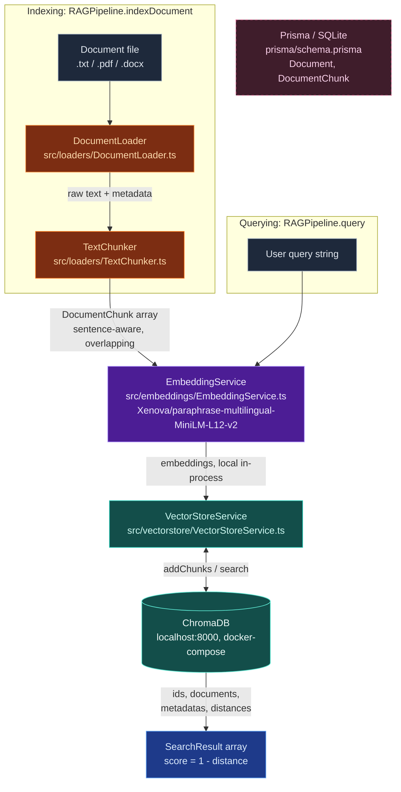

# multilingual-rag-pipeline

A local, in-process multilingual RAG (Retrieval-Augmented Generation) indexing/query pipeline. Documents are loaded, chunked, embedded (locally, via `@xenova/transformers`), and stored in ChromaDB for semantic search.

## Architecture



> **Note:** the Prisma/SQLite schema (`Document`/`DocumentChunk`) exists but isn't wired into the pipeline yet — `VectorStoreService`/ChromaDB is the only persistence layer currently in use.

## Setup

To install dependencies:

```bash
bun install
```

To run:

```bash
bun run index.ts
```

This project was created using `bun init` in bun v1.2.23. [Bun](https://bun.com) is a fast all-in-one JavaScript runtime.
