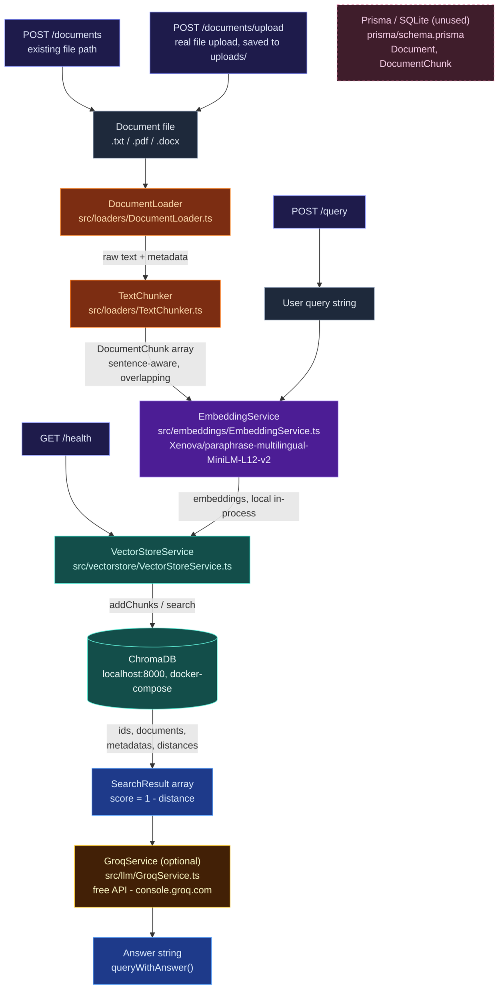

# multilingual-rag-pipeline

A local, in-process multilingual RAG (Retrieval-Augmented Generation) pipeline. Documents are loaded, chunked, embedded (locally, via `@xenova/transformers`), and stored in ChromaDB for semantic search — then an optional Groq-generated answer is layered on top, all exposed over a REST API built with Elysia.

## Architecture



> **Notes:** the Prisma/SQLite schema (`Document`/`DocumentChunk`) exists but isn't wired into the pipeline yet — `VectorStoreService`/ChromaDB is the only persistence layer currently in use. `GroqService` is optional too: without a `GROQ_API_KEY`, `/query` still returns retrieved chunks, just with `answer: null` instead of a generated one.

## Project Structure

```
multilingual-rag-pipeline/
├── 🚀 index.ts                      # entrypoint - starts the REST API (createServer().listen())
├── 🐳 docker-compose.yml            # ChromaDB container definition
├── 🔑 .env.sample                   # every configurable env var, documented - copy to .env
│
├── 📁 src/
│   ├── 📁 api/
│   │   └── 📄 server.ts             # Elysia app: GET /health, POST /documents, POST /documents/upload, POST /query
│   ├── 📁 pipeline/
│   │   └── 📄 RAGPipeline.ts        # orchestrates load -> chunk -> embed -> store -> query -> answer
│   ├── 📁 loaders/
│   │   ├── 📄 DocumentLoader.ts     # .txt / .pdf / .docx -> raw text + metadata
│   │   └── 📄 TextChunker.ts        # sentence-aware chunking with overlap
│   ├── 📁 embeddings/
│   │   └── 📄 EmbeddingService.ts   # local multilingual embeddings via @xenova/transformers
│   ├── 📁 vectorstore/
│   │   └── 📄 VectorStoreService.ts # ChromaDB client wrapper
│   ├── 📁 llm/
│   │   └── 📄 GroqService.ts        # GroqCloud chat completion client (answer generation)
│   └── 📁 types/                    # shared types - see CLAUDE.md, not all are re-exported from index.ts
│
├── 🧪 tests/                        # standalone smoke-test scripts, no test framework - run individually with bun
├── 📁 prisma/
│   └── 📝 schema.prisma             # Document/DocumentChunk models - not yet wired into the pipeline
├── 📁 seed/
│   └── 🗄️ dev.db                    # SQLite file (Prisma datasource)
│
├── ⚙️ package.json
└── ⚙️ tsconfig.json
```

Not shown above: `node_modules/`, `chroma-data/`, `uploads/`, `generated/prisma/`, and `graphify-out/` — all gitignored, created at runtime or on install rather than checked into the repo.

## Getting Started

### 1. Clone the repository

```bash
git clone https://github.com/vzan2012/multilingual-rag-pipeline.git
cd multilingual-rag-pipeline
```

### 2. Install dependencies

```bash
bun install
```

### 3. Configure environment variables

Copy `.env.sample` to `.env` and fill in real values:

```bash
cp .env.sample .env
```

Only `DATABASE_URL` is required out of the box (already set to a local SQLite file). `GROQ_API_KEY` is optional — get a free key at [console.groq.com](https://console.groq.com) if you want generated answers on `/query`; without it, `/query` still returns retrieved chunks, just with `answer: null`.

### 4. Initialize the database with Prisma

```bash
bunx prisma generate
bunx prisma migrate dev
```

This generates the Prisma client and applies the SQLite schema (`Document`/`DocumentChunk`). Note: the pipeline itself doesn't read/write through Prisma yet — this step only matters if you're extending it to persist document metadata relationally.

### 5. Start ChromaDB

**With Docker (recommended):**

```bash
docker-compose up -d
```

Runs ChromaDB on `localhost:8000`, persisted to `./chroma-data`.

**Without Docker:**

```bash
pip install chromadb
chroma run --path ./chroma-data --port 8000
```

Either way, `CHROMA_HOST`/`CHROMA_PORT` in `.env` should match wherever it's actually listening (defaults to `localhost:8000`).

### 6. Run the project

```bash
bun run index.ts
```

Starts the REST API at `http://localhost:3000` (override with `PORT` in `.env`).

### Try it

```bash
curl http://localhost:3000/health

# Index a file that already exists on the server's filesystem
curl -X POST http://localhost:3000/documents -H "Content-Type: application/json" -d '{"filePath":"sample.txt","language":"en"}'

# Upload a file from your machine (saved to uploads/, then indexed)
curl -X POST http://localhost:3000/documents/upload -F "file=@sample.txt" -F "language=en"

curl -X POST http://localhost:3000/query -H "Content-Type: application/json" -d '{"query":"what is this document about"}'
```

`/documents` only works if `filePath` already points to a file on the same machine the server runs on — it does not accept file bytes. `/documents/upload` is the actual upload path: send the file itself as multipart form-data and the server saves it to `uploads/` (gitignored) before indexing.

This project was created using `bun init` in bun v1.2.23. [Bun](https://bun.com) is a fast all-in-one JavaScript runtime.

## Author

Deepak Guptha Sitharaman
